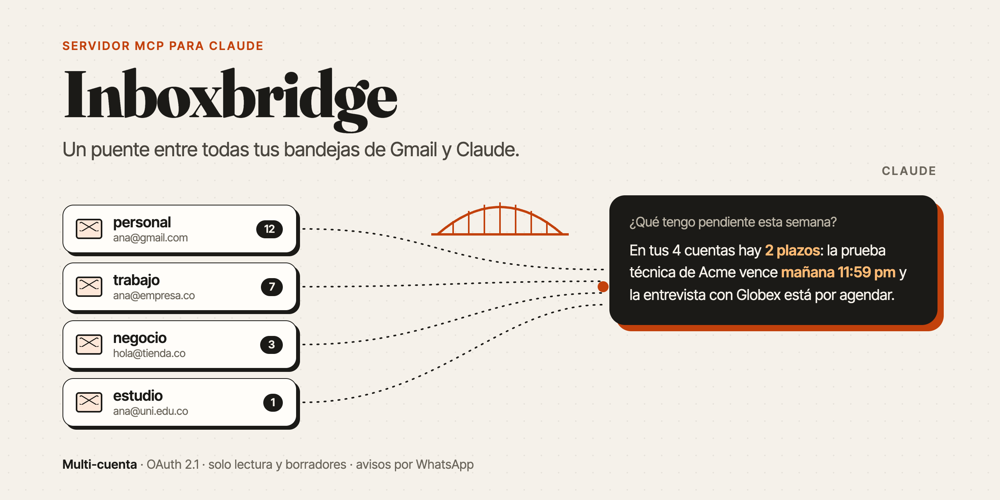
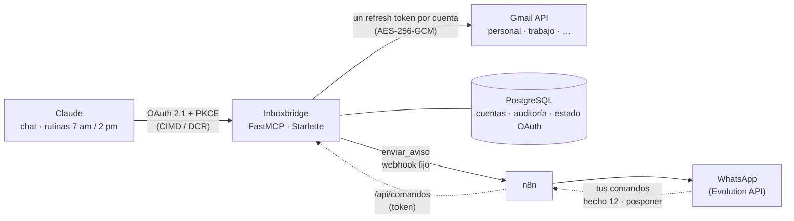

<p align="center">
  
</p>

<p align="center">
  <a href="https://github.com/devzapataa/inboxbridge-mcp/actions/workflows/ci.yml"></a>
  
  
  
  <a href="LICENSE"></a>
</p>

# Inboxbridge

**Un servidor [MCP](https://modelcontextprotocol.io) remoto que conecta Claude con todas tus cuentas de Gmail a la vez, y te avisa por WhatsApp cuando algo importante tiene plazo.**

El conector oficial de Gmail en Claude admite una sola cuenta. Si tus correos importantes llegan a varias (la personal, la del trabajo, la de un negocio), lo que pasa en las demás no lo ves a tiempo: una prueba técnica con fecha límite, una entrevista por agendar, una factura que vence. Inboxbridge las une detrás de un solo conector. Le preguntas a Claude una vez y busca en todas.

## Qué puedes hacer

Con el conector agregado en Claude (web, escritorio, celular o Claude Code), puedes pedirle cosas como estas:

- *"¿Qué correos sin leer tengo hoy en todas mis cuentas?"*
- *"¿Tengo algún plazo esta semana? Revisa procesos de empleo y trámites."*
- *"Resume el hilo con Acme y déjame un borrador de respuesta."*

Y sin que tengas que preguntar, dos [rutinas programadas de Claude](https://claude.ai/code/routines) usan el mismo conector:

| Hora | Qué hace | Te avisa |
|---|---|---|
| **7:00 am** | Revisa todas las cuentas y busca plazos de los últimos 21 días (pruebas técnicas, entrevistas, citaciones, pagos). Lo que ya leíste solo vuelve si su plazo está encima. | Siempre, por push y por WhatsApp. Así sabes que la revisión corrió. |
| **2:00 pm** | Una pasada corta: solo lo que vence hoy o mañana y sigue sin atender. | Solo si hay algo urgente. |
| **Domingo 6 pm** | Tablero de tus procesos de empleo: postulado, prueba pendiente, prueba enviada, esperando respuesta, descartado. | Siempre. |

Además, las rutinas:

- **Recuerdan lo que ya te dijeron.** Cada plazo queda como un seguimiento con número (#12), y lo que marcas como hecho no se vuelve a mencionar.
- **Ponen el plazo en tu calendario**, con alarma, y **te dejan el borrador** de los seguimientos que te toca enviar (nunca los envían).
- **Leen los PDF adjuntos** cuando el dato está en el documento y no en el correo.
- **Te dejan responder por WhatsApp:** *hecho 12*, *descartar 12*, *posponer 12 lunes* o *lista*.
- **Avisan si fallan:** si a las 7:40 am no salió el resumen, llega una alerta por Telegram.

## Cómo funciona



Hay dos capas de OAuth:

| Capa | Entre | Qué hace |
|---|---|---|
| A | Claude → Inboxbridge | FastMCP hace de servidor de autorización: metadatos RFC 9728/8414, CIMD y DCR, PKCE S256 y rotación de tokens. Para identificarte usa Google, y solo pasan los correos de `OWNER_EMAILS`. |
| B | Inboxbridge → Google | Cada cuenta de Gmail se conecta en `/cuentas` y deja un refresh token cifrado. El access token se guarda en memoria y se renueva con un candado por cuenta. |

## Herramientas

| Herramienta | Qué hace |
|---|---|
| `listar_cuentas` | Cuentas conectadas, con alias y estado. |
| `buscar_correos` | Busca con la sintaxis de Gmail en una cuenta o en todas en paralelo, y ordena por fecha. Si una cuenta falla, las demás responden igual. |
| `leer_hilo` | Hilo completo en texto (convierte el HTML), con remitentes, fechas y adjuntos. |
| `crear_borrador` | Borrador nuevo o respuesta dentro de un hilo (`In-Reply-To` / `References`). Nunca envía. |
| `leer_adjunto` | Texto de un adjunto PDF o de texto (máximo 10 MB y 40 páginas). Los PDF con contraseña dan un error claro. |
| `conectar_cuenta` | Enlace para conectar otra cuenta o reconectar una revocada. |
| `listar_seguimientos` | La memoria de las rutinas: plazos y procesos vigilados, con su número, estado y fecha. |
| `registrar_seguimiento` | Guarda un plazo o proceso. Si ya existía, actualiza los datos sin reabrir lo que estaba hecho. |
| `actualizar_seguimiento` | Lo marca como avisado, hecho, descartado o vencido, lo pospone, o guarda el id del evento de calendario o del borrador para no repetirlos. |
| `enviar_aviso` | Aviso al dueño por un canal fijo (por ejemplo, WhatsApp vía n8n). Solo existe si hay `AVISOS_WEBHOOK_URL`. |

## Decisiones de seguridad

Un servidor con acceso a varios buzones es un blanco atractivo, y los correos los escriben terceros. El diseño parte de ahí:

- **No hay herramientas para enviar, reenviar ni borrar.** Un correo malicioso puede intentar que el modelo saque datos (prompt injection). Con solo borradores, quien envía siempre es una persona desde Gmail. Una prueba lo verifica.
- **La única salida, `enviar_aviso`, solo puede escribirle al dueño.** Claude decide el texto, pero no el destino: la URL del webhook está en el `.env` y el destinatario lo fija el workflow que la recibe. Además tiene un límite diario (`AVISOS_MAX_DIARIOS`) y quita los caracteres de control. Por eso las rutinas no necesitan acceso a n8n: si lo tuvieran, un correo podría pedirles ejecutar cualquier otro workflow.
- **Los comandos por WhatsApp solo tocan la memoria de seguimientos, nunca el correo.** Llegan por `/api/comandos`, que exige un token (`API_TOKEN`), y n8n solo reenvía los mensajes que vienen de tu número. En el peor caso, alguien marcaría un recordatorio como hecho.
- **Tokens cifrados con AES-256-GCM, con el email de la cuenta como dato asociado:** un token no se descifra si lo mueven a otra fila. Las llaves se derivan con HKDF desde un único `MASTER_KEY` (una por propósito).
- **Lista cerrada de dueños** en las dos capas de OAuth, aunque Google valide a cualquiera.
- **URLs de regreso permitidas:** solo las de claude.ai y loopback (Claude Code). Los trucos tipo `localhost@evil.com` se rechazan.
- **Los ids de Gmail se validan** antes de armar rutas, para que un id fabricado no llegue a otro endpoint.
- **Páginas web** con cookie firmada (`secure`, `httponly`, `samesite=lax`), CSRF, CSP estricta y PKCE también hacia Google.
- **Auditoría** solo de metadatos (herramienta, cuenta, resultado y duración). Nunca guarda consultas ni contenido.
- **Contenedor** con usuario sin privilegios, sistema de archivos de solo lectura, `no-new-privileges` y límite de memoria.

## Stack

Python 3.14 · FastMCP 4 · Starlette · asyncpg · httpx · Pydantic · cryptography · pypdf · uv · pytest + respx · ruff · pyright · Docker · Traefik · GitHub Actions

## Puesta en marcha

### 1. Google Cloud

1. **Cliente OAuth** de tipo *Aplicación web*, con estas URIs de redirección:
   - `https://tu-dominio/auth/callback`: para entrar cuando Claude se conecta.
   - `https://tu-dominio/google/callback`: para conectar cuentas de Gmail.
2. **Acceso a datos:** `openid`, `email`, `gmail.readonly` y `gmail.compose`.
3. **Publicación:** estado *En producción*. En *Prueba* los refresh tokens vencen a los 7 días. Para uso personal no hace falta verificar la app; Google muestra un aviso y se sigue por *Avanzado → Ir a…*.

### 2. Configuración

Copia `.env.example` a `.env`. Lo mínimo: `BASE_URL`, las credenciales de Google, `DATABASE_URL`, `OWNER_EMAILS` y un `MASTER_KEY` (`openssl rand -base64 48`). Los avisos (`AVISOS_WEBHOOK_URL`, `AVISOS_WEBHOOK_TOKEN`) y la API para n8n (`API_TOKEN`) son opcionales.

### 3. Desarrollo

```bash
docker compose -f compose.dev.yml up -d   # Postgres local en el puerto 5433
cp .env.example .env                      # y llénalo
uv run inboxbridge                        # http://localhost:8000
uv run pytest                             # 75 pruebas: herramientas MCP, seguimientos, comandos, adjuntos, avisos y flujo web
```

### 4. Despliegue

```bash
./scripts/desplegar.sh
```

El script trae la última versión, construye la imagen, levanta el contenedor detrás de Traefik y espera a que el healthcheck quede sano.

La base de datos no tiene backup a propósito. Si se pierde, se reconectan las cuentas en un minuto, y no queda ninguna copia de los tokens dando vueltas.

### 5. Conectarlo a Claude

En claude.ai → *Configuración → Conectores → Agregar conector personalizado*, con la URL `https://tu-dominio/mcp`. Luego conecta tus cuentas de Gmail en `https://tu-dominio/cuentas`.

---

Hecho por [Yonier Zapata](https://github.com/devzapataa) · [Licencia MIT](LICENSE)
