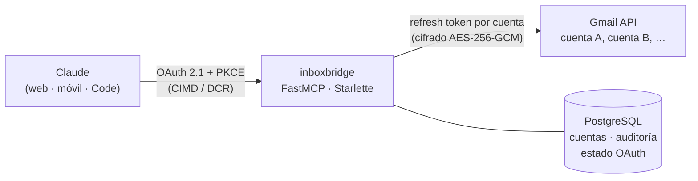

# inboxbridge-mcp

Servidor [MCP](https://modelcontextprotocol.io) remoto que le da a Claude acceso a **varias cuentas de Gmail** a la vez. El conector oficial solo admite una cuenta.

Se agrega en claude.ai como conector personalizado (`https://correo-mcp.konto.org.in/mcp`) y queda disponible en la web, la app de escritorio, el celular y Claude Code.

## Arquitectura



Hay dos capas de OAuth:

| Capa | Entre | Qué hace |
|---|---|---|
| A | Claude → servidor | FastMCP hace de servidor de autorización: metadatos RFC 9728/8414, CIMD y DCR, PKCE S256 y rotación de tokens. Para identificarte usa Google, y solo pasan los correos de `OWNER_EMAILS`. |
| B | Servidor → Google | Cada cuenta de Gmail se conecta en `/cuentas` y deja un refresh token cifrado. El access token se guarda en memoria y se renueva con un candado por cuenta. |

## Herramientas

| Herramienta | Qué hace |
|---|---|
| `listar_cuentas` | Cuentas conectadas, con alias y estado. |
| `buscar_correos` | Busca con la sintaxis de Gmail en una cuenta o en todas en paralelo, y ordena por fecha. |
| `leer_hilo` | Hilo completo en texto (convierte el HTML), con remitentes, fechas y adjuntos. |
| `crear_borrador` | Borrador nuevo o respuesta dentro de un hilo (`In-Reply-To` / `References`). |
| `conectar_cuenta` | Enlace para conectar otra cuenta o reconectar una revocada. |

## Decisiones de seguridad

- **No hay herramientas para enviar, reenviar ni borrar.** Un correo malicioso puede intentar que el modelo saque datos (prompt injection). Con solo borradores, quien envía siempre es una persona desde Gmail. Una prueba lo verifica.
- **Tokens cifrados con AES-256-GCM, con el email de la cuenta como dato asociado:** un token no se descifra si lo mueven a otra fila. Las llaves se derivan con HKDF desde un único `MASTER_KEY` (una por propósito).
- **Lista cerrada de dueños** en las dos capas, aunque Google valide a cualquiera.
- **URLs de regreso permitidas** solo las de claude.ai y loopback (Claude Code). Los trucos tipo `localhost@evil.com` se rechazan.
- **Los ids de Gmail se validan** antes de armar rutas, para que un id fabricado no llegue a otro endpoint.
- **Páginas web** con cookie firmada (`secure`, `httponly`, `samesite=lax`), CSRF, CSP estricta y PKCE también hacia Google.
- **Auditoría** solo de metadatos (herramienta, cuenta, resultado y duración). Nunca guarda consultas ni contenido.
- **Contenedor** con usuario sin privilegios, sistema de archivos de solo lectura, `no-new-privileges` y límite de memoria.

## Stack

Python 3.14 · FastMCP 4 · Starlette · asyncpg · httpx · Pydantic · cryptography · uv · pytest + respx · ruff · pyright · Docker · Traefik · GitHub Actions

## Configuración de Google Cloud

1. **Cliente OAuth** de tipo *Aplicación web*, con estas URIs de redirección:
   - `https://correo-mcp.konto.org.in/auth/callback`: entrar cuando Claude se conecta.
   - `https://correo-mcp.konto.org.in/google/callback`: conectar cuentas de Gmail.
2. **Acceso a datos:** `openid`, `email`, `gmail.readonly` y `gmail.compose`.
3. **Publicación:** estado *En producción*. En *Prueba* los refresh tokens vencen a los 7 días. Para uso personal no hace falta verificar la app; Google muestra un aviso y se sigue por *Avanzado → Ir a…*.

## Desarrollo

```bash
docker compose -f compose.dev.yml up -d   # Postgres local en el puerto 5433
cp .env.example .env                      # y llénalo
uv run inboxbridge                         # http://localhost:8000
uv run pytest                             # 35 pruebas: unidades, herramientas MCP y flujo web
```

## Despliegue (VPS)

```bash
cd /opt/inboxbridge-mcp && ./scripts/desplegar.sh
```

El script trae la última versión, construye la imagen, levanta el contenedor detrás de Traefik y espera a que el healthcheck quede sano.

La base de datos no tiene backup a propósito. Si se pierde, se reconectan las cuentas en un minuto, y no queda ninguna copia de los tokens dando vueltas.
